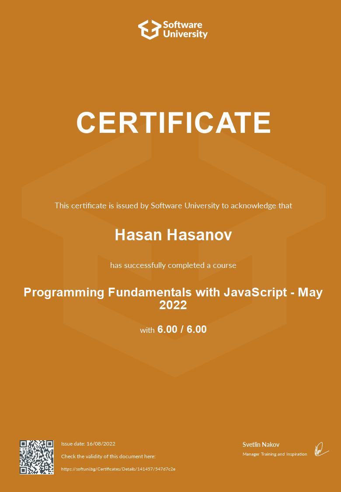

# SoftUni-JS-Fundamentals

<h2>Basic Syntax, Conditional Statements and Loops</h2>
• Introduction and IDE; 
• JavaScript Syntax; 
• Conditional Statements; 
• Loops (while and for Loops); 
• Debugging and Troubleshooting. 

<h2>HTTP Basics</h2>
• HTTP Developer Tools; 
• HTML Forms, Request, Response; 
• URLs and ERL Structure; 

<h2>Data Types and Variables</h2>
• What is Data Type?;  
• let vs. var; 
• Strings; 
• Numbers; 
• Booleans; 
• typeof Operator; 
• Undefined and Null; 

<h2>HTML & CSS Basics</h2>
• Intro to HTML; 
• HTML Common Elements; 
• Introduction to CSS; 
• Selectors; 
• Block Elements; 
• Dev Tools; 
• Fonts. 

<h2>Arrays</h2>
• What are Arrays?; 
• Array Operations; 
• Array Iteration; 
• for-of Loop. 

<h2>Software Development Concepts - Part 1</h2>
• The 4 Skills of Sotware Engineers; 
• Fundamental Software Engineering Concepts; 
• Software Architectures, Front-End and Back-End. 

<h2>Functions</h2>
• What is a Function?; 
• Declaring and Invoking Methods; 
• Nested Functions; 
• Value vs Reference Types; 
• Arrow Functions; 
• Naming and Best Practices. 

<h2>Software Development Concepts - Part 2</h2>
• Front-End Development Concepts; 
• Back-End Development Concepts; 
• Embedded Systems and IoT; 
• Software Engineering Concepts; 

<h2>Arrays Advanced</h2>
• Array Functionality; 
• Array Operations (push, pop, shift, unshift, filtering and transforming elements); 
• Sorting Arrays. 

<h2>Objects and Classes</h2>
• Objects (definition, properties and methods); 
• Reference vs. Value Types; 
• JSON; 
• Classes. 

<h2>Bitwise Operations</h2>
• What is a Bit, Byte, KB, MB?; 
• Numerals Systems; 
• Representation of Data in Computer Memory.

<h2>Associative Arrays</h2>
• Associative Arrays (definition, attributes, iteration); 
• Map (methods, sorting); 
• Set.

<h2>Problem Solving</h2>
• Fundamental Skills of Software Engineers; 
• Problems: Definition and Problem Solving; 
• Stages of Problem Solving; 
• Solving Exam Problems.

<h2>Text Processing</h2>
• Strings; 
• Manipulating Strings (Concatenating, Searching, Substring, Splitting, Replacing).

<h2>Database Basics</h2>
• Databases Introduction; 
• SQL vs. NoSQL Databases; 
• DBMS Systems; 
• Relational Databases, SQL and MySQL Database; 
• NoSQL Databases and MongoDB;

<h2>Regular Expressions</h2>
• Regular Expressions (Definition and Pattern, Predefined Character Classes); 
• Quantifiers and Grouping; 
• Backreferences.

<h2>Git and GitHub</h2>
• Software Configuration Management; 
• Introduction to Git; 
• Introduction to GitHub;

<h2>QA Introduction</h2>
• Software Quality Assurance; 
• QA Engineers and Resposibilities; 
• Bugs and Bug Trackers; 
• Testing, Test Types and Test Levels; 
• Test Automation, Frameworks and Tools; 

<h2>Basic Web Project</h2>
• Node Modules (HTTP, Creationg simple HTTP Server); 
• Express.js Framework; 
• MVC; 
• MVC with Node, Express.js, Handlebars. 

